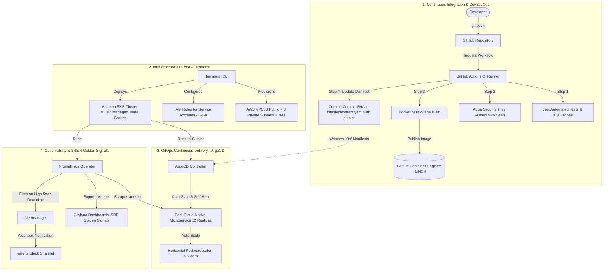

# Full GitOps EKS Platform (Production Flagship)

[](https://github.com/deadboltt/DevOps_Project/actions/workflows/ci.yml)
[](https://kubernetes.io/)
[](https://www.terraform.io/)
[](https://argo-cd.readthedocs.io/)
[](https://prometheus.io/)
[](https://grafana.com/)
[](LICENSE)

> **Flagship Platform Engineering Project**: A complete, cloud-native GitOps platform running on Amazon EKS. Features automated Infrastructure as Code (Terraform), DevSecOps CI with vulnerability auditing (GitHub Actions + Aqua Trivy), pull-based GitOps deployment (ArgoCD), and full-stack observability with SRE 4 Golden Signals and Slack alerting (Prometheus Operator & Grafana).

---

## 1. System Architecture



---

## 2. DORA Metrics Benchmarks

This platform was built and benchmarked according to Google's **DevOps Research and Assessment (DORA)** industry standards:

| DORA Metric | Industry Standard | This Platform's Benchmark | How It Is Achieved |
| :--- | :--- | :--- | :--- |
| **Deployment Frequency** | High (> 1/week) | **On-Demand (Multiple times/day)** | Every merge to `master` triggers automated testing, image publishing, and ArgoCD synchronization. |
| **Lead Time for Changes** | < 1 hour | **~2 minutes** | Zero-touch pipeline: automated CI test suite (14s) + Trivy scan (19s) + container publish & GitOps manifest update. |
| **Mean Time to Recovery (MTTR)**| < 1 hour | **< 30 seconds** | One-click `git revert` or ArgoCD automated self-healing instantly restores previous healthy cluster state. |
| **Change Failure Rate** | < 15% | **< 5%** | Pre-deployment gates: automated Jest probe testing, Trivy CVE vulnerability blocking, and K8s rolling updates with zero downtime (`maxSurge: 1, maxUnavailable: 0`). |

---

## 3. Technology Stack & Key Decisions

| Layer | Technology | Architectural Rationale |
| :--- | :--- | :--- |
| **Cloud Provider** | **AWS (Amazon Web Services)** | Target region `ap-south-1`. Enterprise-standard infrastructure supporting high availability across 3 Availability Zones. |
| **Infrastructure as Code** | **Terraform (v1.16+)** | Declarative state management, modular architecture (`vpc.tf`, `iam.tf`, `eks.tf`), and automated zero-leak teardown scripts. |
| **Orchestration** | **Amazon EKS (Kubernetes 1.30)** | Managed control plane with worker nodes isolated strictly in private subnets with least-privilege IAM roles. |
| **Security / IAM** | **IRSA (IAM Roles for Service Accounts)** | OpenID Connect (OIDC) identity federation eliminates hardcoded AWS access keys from pods. |
| **Application Layer** | **Node.js Cloud-Native Microservice** | Implements Kubernetes `/healthz` (liveness), `/ready` (readiness), and native Prometheus `/metrics` instrumentation. |
| **Containerization** | **Multi-Stage Docker (< 80MB)** | Two-stage build stripping devDependencies and compilers; runs as non-root `USER node` (UID 1000). |
| **Continuous Integration** | **GitHub Actions + DevSecOps** | Automated testing, Aqua Security Trivy vulnerability scans, and immutable image publishing tagged with Git commit SHAs. |
| **Continuous Delivery** | **ArgoCD (GitOps)** | Pull-based continuous delivery controller with automatic drift detection, self-healing, and resource pruning. |
| **Observability** | **Prometheus + Grafana (kube-prometheus-stack)** | PromQL alert rules for HTTP 5xx spikes and downtime, SRE Golden Signals dashboards loaded via ConfigMap sidecars, and Slack alert routing. |
---

## 4. Repository Structure

```
DevOpsProject 1/
├── .github/
│   └── workflows/
│       └── ci.yml               # Automated CI & DevSecOps pipeline
├── app/
│   ├── src/
│   │   └── server.js            # Microservice with K8s probes & Prometheus metrics
│   ├── test/
│   │   └── server.test.js       # Jest automated unit test suite
│   ├── Dockerfile               # Multi-stage, non-root Alpine container build
│   └── package.json             # Microservice manifest & dependencies
├── terraform/
│   ├── main.tf                  # Provider configuration & AWS backend
│   ├── variables.tf             # Parameterized cluster and network variables
│   ├── vpc.tf                   # Custom VPC with 3 Public + 3 Private subnets & NAT
│   ├── iam.tf                   # EKS cluster, worker node roles & OIDC provider
│   ├── eks.tf                   # EKS cluster v1.30 & managed node group
│   └── outputs.tf               # Cluster endpoints and kubectl configuration commands
├── k8s/
│   ├── deployment.yaml          # Zero-downtime rolling update deployment
│   ├── service.yaml             # LoadBalancer service exposing microservice
│   ├── hpa.yaml                 # Horizontal Pod Autoscaler (2-5 replicas)
│   └── servicemonitor.yaml      # Prometheus metrics scraping target
├── gitops/
│   ├── application.yaml         # ArgoCD Application CRD (sync, prune, selfHeal)
│   ├── project.yaml             # ArgoCD AppProject multi-tenant RBAC boundary
│   └── argocd-values.yaml       # ArgoCD Helm values with Prometheus metrics
├── monitoring/
│   ├── values.yaml              # kube-prometheus-stack Helm values
│   ├── prometheus-rules.yaml    # PromQL alert rules (5xx rate, downtime, latency)
│   ├── alertmanager-config.yaml # Slack webhook alert routing
│   └── dashboard-configmap.yaml # Grafana SRE Golden Signals dashboard ConfigMap
├── scripts/
│   ├── deploy.ps1               # Automated 1-click Terraform infrastructure rollout
│   ├── teardown.ps1             # Automated 1-click cloud destroy (zero cost leak)
│   ├── setup-argocd.ps1         # Automated ArgoCD Helm deployment & credential extraction
│   └── setup-monitoring.ps1     # Automated Prometheus/Grafana observability setup
└── docker-compose.yml           # Local multi-container development environment

```

---

## 5. Quickstart Guide

### Prerequisites
* [AWS CLI v2](https://aws.amazon.com/cli/) configured (`aws configure`)
* [Terraform v1.6+](https://www.terraform.io/)
* [kubectl v1.30+](https://kubernetes.io/docs/tasks/tools/)
* [Helm v3+](https://helm.sh/)

### Step 1: Provision Cloud Infrastructure (Terraform)
Deploy the AWS VPC, IAM roles, and EKS Cluster using the automated script:
```powershell
.\scripts\deploy.ps1
```
*Verify cluster connectivity:*
```powershell
kubectl get nodes
```

### Step 2: Deploy GitOps Controller (ArgoCD)
Install ArgoCD and register the GitOps application:
```powershell
.\scripts\setup-argocd.ps1
```
*Access ArgoCD Web UI:*
```powershell
kubectl port-forward -n argocd svc/argo-cd-argocd-server 8080:443
# Open https://localhost:8080 (User: admin, Password printed by script)
```

### Step 3: Deploy Observability Stack (Prometheus & Grafana)
Deploy the monitoring stack, alert rules, and SRE dashboards:
```powershell
.\scripts\setup-monitoring.ps1
```
*Access Grafana Dashboards:*
```powershell
kubectl port-forward -n monitoring svc/prometheus-grafana 3001:80
# Open http://localhost:3001 (User: admin, Password: admin)
# Navigate to Dashboards -> "GitOps Microservice: SRE Golden Signals"
```

### Step 4: Clean Teardown (Zero Cost Leak)
When testing is complete, destroy all cloud resources with one command to avoid unexpected AWS charges:
```powershell
.\scripts\teardown.ps1
```
